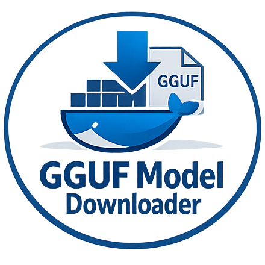
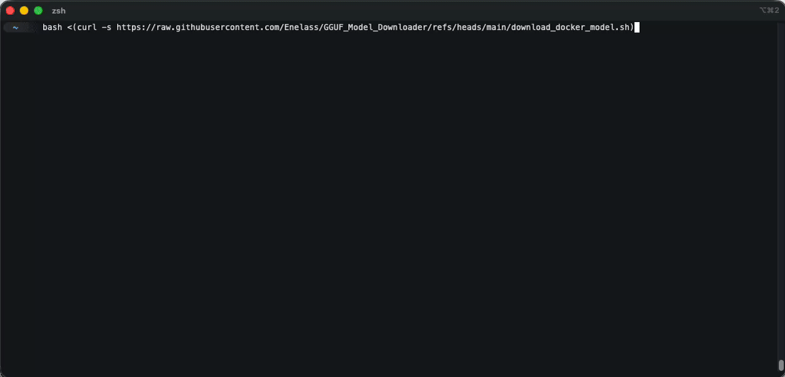
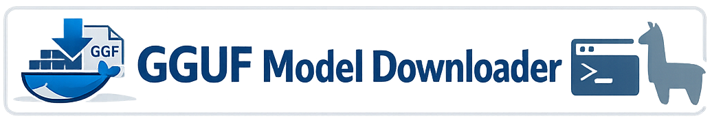

<p align="center">
  
</p>

# GGUF Model Downloader

A trusted list of reputable GGUF models sourced from Docker `ai/*` repositories. Enables GGUF downloads where corporate network restrictions may block Ollama, Hugging Face, or ModelScope. Automatically identify the correct GGUF blob and print ready-to-run import/run commands for Ollama or llama.cpp.


[](LICENSE)
[](https://github.com/Enelass/GGUF_Model_Downloader/releases)

Interactive script to download GGUF AI models via Docker and import them into Ollama.



## Prerequisites

- **Bash** (macOS ships Bash 3.2)
- **Docker Desktop** (required) must be installed and running
- **jq** (used to parse the Docker Hub API)
- **gguf_dump** (from llama.cpp) must be installed and on PATH; used to identify GGUF metadata
- **Ollama** (optional) to run the downloaded models

## Installation & Usage

Run with a single command:

```bash
bash <(curl -s https://raw.githubusercontent.com/Enelass/GGUF_Model_Downloader/refs/heads/main/download_docker_model.sh)
```

## Changelog / Releases

- Changelog: `CHANGELOG.md`
- Release process: `RELEASING.md`

## Features

- Fetches an up-to-date list of Docker Hub `ai/*` models every run
- Browse dozens of AI models (Qwen, DeepSeek, Gemma, LLaMA, Mistral, etc.)
- Interactive menu with arrow key navigation
- Automatic GGUF file detection
- Ready-to-use Ollama import commands

## Navigation

- **Arrow keys**: Navigate pages
- **Number + Enter**: Select model
- **q**: Quit

That's it. Run the script, pick a model, and follow the on-screen instructions.


