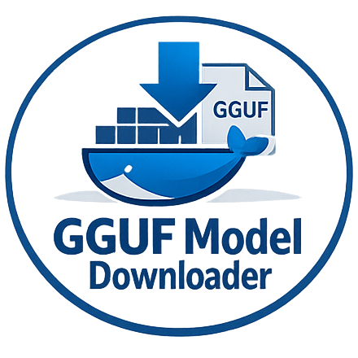
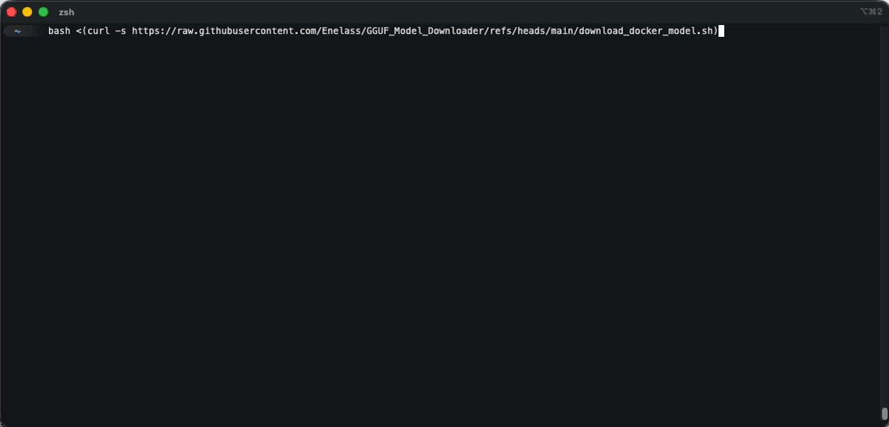
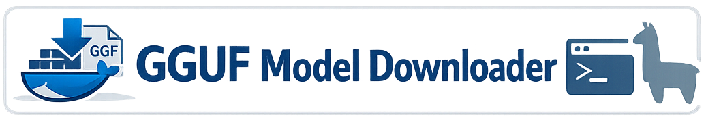

<p align="center">
  
</p>

# Docker Model Downloader

Interactive downloader for Docker `ai/*` GGUF models, designed for importing the downloaded blobs into other local runtimes such as Ollama and llama.cpp.

Why this exists:
  - Docker Desktop's model GUI can fail to fetch model metadata even when the `docker model` CLI still works.
  - `docker model pull` can fail on unreliable or corporate networks; this script automatically retries downloads.
  - Docker can be an allowed route for GGUF downloads where Ollama, Hugging Face, or ModelScope are blocked.
  - Downloaded Docker GGUF blobs can then be reused in Ollama, llama.cpp, or other GGUF-compatible apps.
  - The script identifies GGUF blobs to simplify importing into Ollama or llama.cpp using `llama-gguf` from Homebrew's `llama.cpp` package, or `gguf_dump` when available.


[](LICENSE)
[](https://github.com/Enelass/Docker_Model_Downloader/releases)

Interactive script to download GGUF AI models via Docker, locate the downloaded GGUF files, and import them into other local runtimes.



## Capabilities

- **Download Docker AI models**: browse the live Docker Hub `ai/*` catalog, select a model, inspect all available tags/variants, and pull the exact variant you want.
- **Recover from flaky pulls**: retries `docker model pull` failures automatically, which helps on unreliable or corporate networks.
- **Inspect local downloads**: scan `~/.docker/models/blobs/sha256/` for completed GGUF blobs, skip incomplete downloads, and show useful metadata such as role, architecture, size, context length, quantization, tensor count, and cropped path.
- **Use Homebrew llama.cpp metadata tooling**: detects `llama-gguf` from `brew install llama.cpp`, while still using `gguf_dump` when available.
- **Reuse Docker GGUF blobs elsewhere**: prints Ollama import commands and file locations so downloaded Docker models can be used with Ollama, llama.cpp, or other GGUF-compatible runtimes.
- **macOS compatibility filtering**: hides vLLM-only Docker model entries on macOS because those variants are not compatible there.

## Prerequisites

- **Bash** (macOS ships Bash 3.2)
- **Docker Desktop** (required) must be installed and running
- **jq** (used to parse the Docker Hub API)
- **llama-gguf** (from `brew install llama.cpp`) or **gguf_dump** must be installed and on PATH; used to identify GGUF metadata
- **Ollama** (optional) to run the downloaded models

## Installation & Usage

Run with a single command:

```bash
bash <(curl -s https://raw.githubusercontent.com/Enelass/Docker_Model_Downloader/refs/heads/main/download_docker_model.sh)
```

## Changelog / Releases

- Changelog: `CHANGELOG.md`
- Release process: `RELEASING.md`

## Features

- Fetches an up-to-date list of Docker Hub `ai/*` models every run
- Starts with a keyboard-selectable action menu for downloading models or checking local downloads
- Shows 20 models per page and crops long model names so the table stays readable
- Lists Docker model variants, not only the default tag, with parameters, quantization, context, VRAM, tool-calling, and size when Docker metadata provides it
- Filters vLLM-only entries on macOS because they are not compatible there
- Checks locally downloaded Docker GGUF blobs without starting a download, including grouped metadata and cropped paths
- Retries failed model downloads automatically
- Shows spinner feedback while retrieving models, variants, and local metadata
- Automatic GGUF file detection with `llama-gguf` or `gguf_dump`
- Ready-to-use Ollama import commands

## Navigation

- **Startup menu**: Up/down arrows choose the action, Enter selects, and the downloader starts automatically after 5 seconds
- **Model list**: Left/right arrows navigate pages
- **Number + Enter**: Select model
- **q**: Quit

That's it. Run the script, pick a model, and follow the on-screen instructions.


